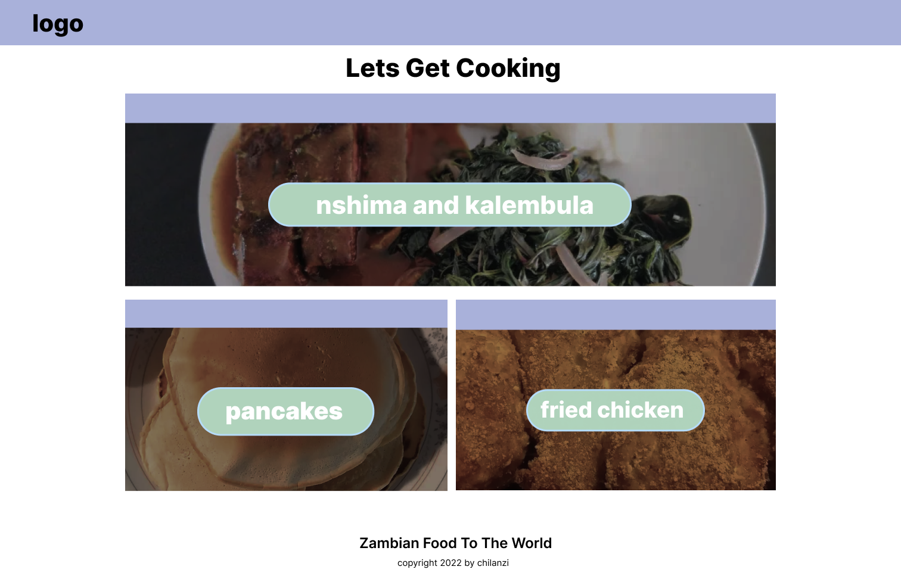
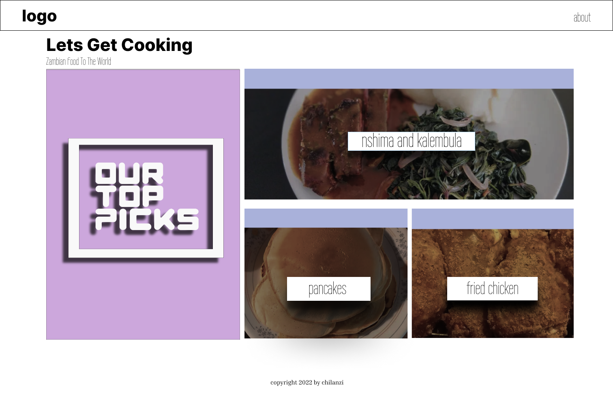
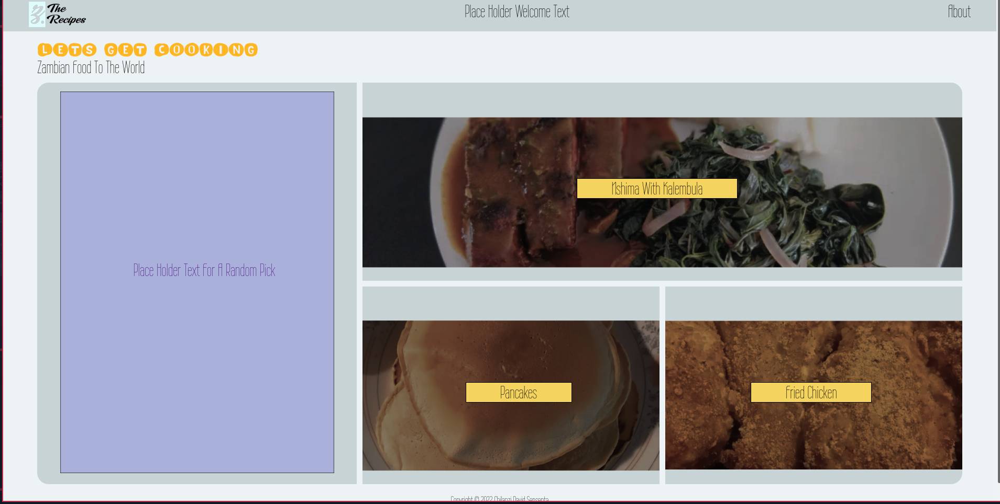
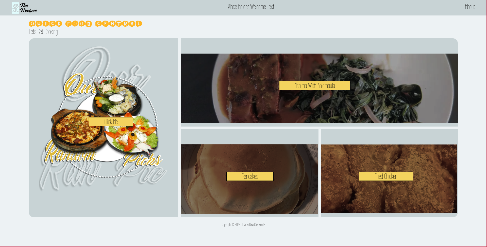
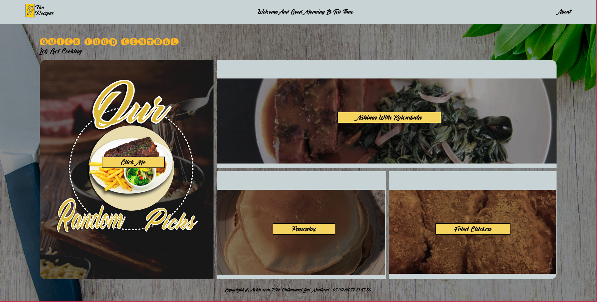
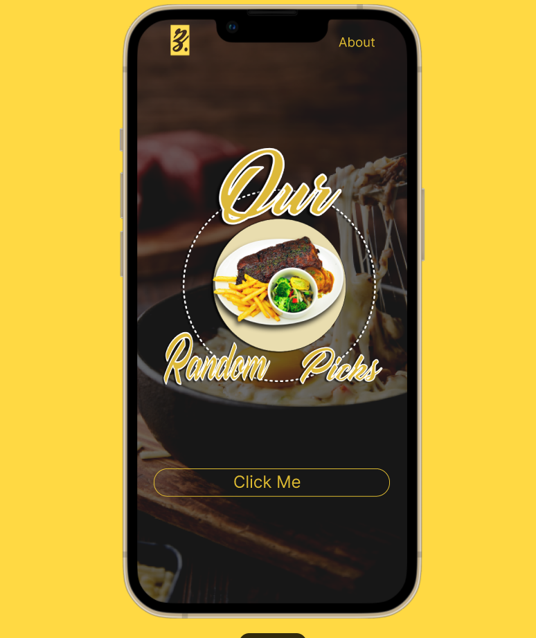
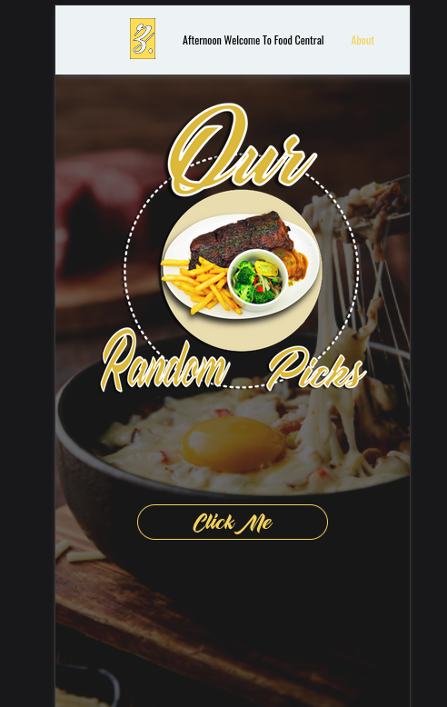
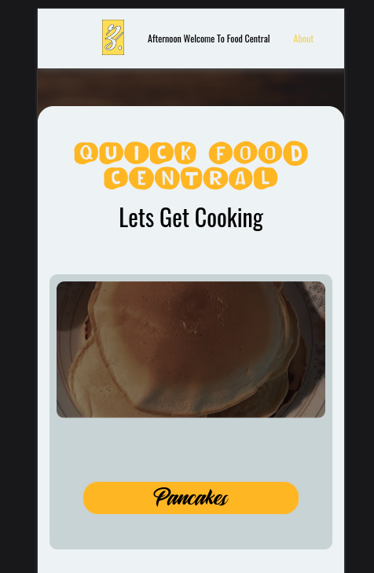

## Table of contents

- [Overview](#overview)
  - [Screenshot](#screenshot)
  - [Links](#links)
- [My process](#my-process)
  - [Built with](#built-with)
  - [What I learned](#what-i-learned)
  - [Continued development](#continued-development)
  - [Useful resources](#useful-resources)
- [Author](#author)
- [Acknowledgments](#acknowledgments)

## Overview
this is a odin project on food recipes

### Screenshot
DESKTOP DESIGN

first i designed a simple ui that i told myself i will improve upon i wanted it to be simple and beautiful at the same time nothing complicated

DESKTOP IMPLEMENTATION

i started styling my landing p[age and kept changing the color scheme ,was trying to have a color scheme that gives off food and cool]

DESKTOP FINAL DESIGN

in this design i was happy with how it turned out.

MOBILE FIGMA DESIGN

Mobile figma design,i first design my ui with figma when i like the design i hard code the design

IMPLEMENTATION.

this design didnt take time to implement i only need to improve on it.

### Links

- Solution URL: [Repository](https://github.com/Chilanzi-thirt33n/ODINS-RECIPES)
- Live Site URL: [Github Pages](https://chilanzi-thirt33n.github.io/ODINS-RECIPES/)

## My process
- html semantics
- sass for styling
- some javascript for random dev
- Pc first
- mobile last

### Built with

- Semantic HTML5 markup
- CSS custom properties
- Flexbox
- CSS Grid

### Continued development

- plan on developing the inner pages by june 

## Author

- Website - [David chilanzi jilliam](https://chilanzi-thirt33n.github.io/ONLINE-CV/)
- Frontend Mentor - [@Chilanzi-thirt33n](https://www.frontendmentor.io/profile/Chilanzi-thirt33n)

